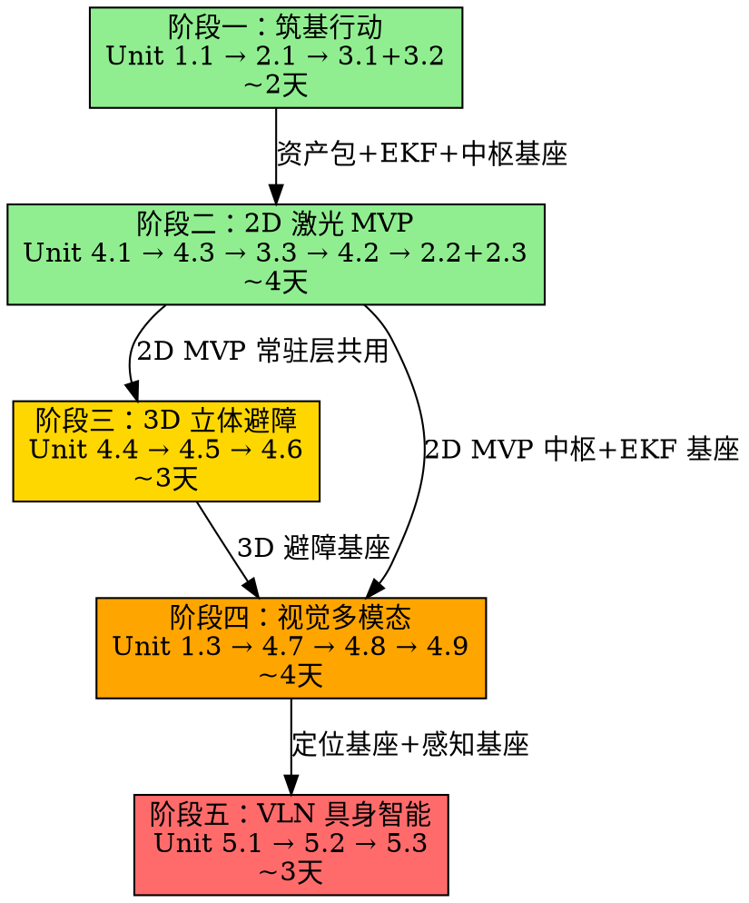

# Robot Adam 高层导航全栈系统全局规格说明书 (SPEC)

> 版本: v1.0
> 日期: 2026-06-28
> 状态: Draft

---

## 1. 系统宏观蓝图 (Top-Down Landscape)

Robot Adam 旨在构建一个解耦物理底盘、算法栈可任意插拔切换、具备类似扫地机器人"全生命周期自主调度"能力，并能通过大语言模型进行具身任务分解的高级机器人系统。

### 1.1 系统全局分层架构

系统从顶层到底层被严格划分为 5 个核心纵向层与 1 个横向资产管理中心。每一层通过标准的 ROS2 接口（Action / Service / Topic）进行通信，任何一层算法的替换，对上下层都是 100% 透明的。

```
====================================================================================
                        Level 5: 具身智能语义决策层 (adam_vln)
             [人类模糊自然语言指令] -> [Ollama/VLM 任务拆解] -> [原子 Action 序列]
====================================================================================
                                      │ (ROS2 Action / Service)
                                      ▼
====================================================================================
                  Level 4: 机器人控制中枢与状态调度层 (adam_hub_controller)
            [ROS2 Lifecycle 托管状态机] -> 动态装载/卸载建图、探索、已知图导航模块
====================================================================================
                                      │ (Lifecycle State Transitions)
                                      ▼
====================================================================================
                Level 3: 可插拔多算法导航与立体避障层 (adam_bringup / adam_navigation)
  ┌───────────────────┬───────────────────┬─────────────────────┬──────────────────┐
  │  2D 几何导航流水线 │  3D 激光导航流水线 │  传统视觉 VSLAM 流水线│ 神经网络 SLAM 流水线│
  │ Cartographer/Nav2 │  FAST-LIO2 / STVL │  ORB-SLAM3 / RTAB    │ DROID-SLAM 稠密网 │
  └───────────────────┴───────────────────┴─────────────────────┴──────────────────┘
====================================================================================
                                      │ (标准化 /cmd_vel 与全局寻路)
                                      ▼
====================================================================================
                       Level 2: 多源传感器状态估计层 (adam_localization)
            [双层 EKF 状态估计器] -> 强力锁死并融合各路 VO/LIO、车轮里程计与高频 IMU
====================================================================================
                                      │ (发布绝对稳定、不跳变的 map -> odom TF 树)
                                      ▼
====================================================================================
                 Level 1: 物理硬件与常驻驱动/仿真层 (Simulation / Hardware Base)
     [Gazebo Classic 11 / 真车硬件接口] -> (2WD/4WD/Omni 底盘) + (Mid360 / 2D雷达 / 相机)
====================================================================================

    ============================================================================
    ★ 横向支撑中心 ★：统一的数据资产与地图集中管理系统 (adam_assets)
    集中式、版本化管理全栈算法产出的所有非结构化资产（.yaml / .pgm / .pcd / .db / .json）
    ============================================================================
```

---

## 2. 问题定义与架构设计目标

### 2.1 当前现状

在底层运控包 `robot_description` 中，已成功实现了 6 种动力学与雷达变体（2WD/4WD/Omni × Mid360/Laser）的仿真基底，消除了万向轮卡死、时钟同步（`use_sim_time`）以及全向轮里程计冲突等物理层隐患。

### 2.2 高层导航痛点

* **环境资产碎片化**：不同算法（2D Laser, 3D LIO, VSLAM, Neural SLAM）生成的地图拓扑、配置文件格式极其杂乱（`.pbstream`, `.pcd`, `.db`, `.yaml`, `.json`），缺乏集中的版本控制与资产分发机制。
* **单一传感器退化**：纯激光雷达（LDS-SLAM）在面对高动态、长走廊、低纹理几何环境时极易发生几何匹配退化与重定位漂移。
* **中枢调度缺失**：建图与导航相互孤立，缺乏一个类似于"扫地机器人中枢"的生命周期管理器（Lifecycle Manager），导致无法通过外部指令平滑切换"无图探索建图"与"已知图自主导航"模式。
* **高端视觉 SLAM 缺位**：缺乏传统高精 VIO（ORB-SLAM3/VINS）与端到端神经网络 SLAM（DROID-SLAM）等多模态视觉感知方案。

### 2.3 设计目标

基于 **ROS2 Humble** 与 **Nav2 异步流水线**，构建一套"多源算法对齐、资产集中管理、开机秒级重定位、三维立体避障、AI具身决策分层"的高层导航框架：

* **多体系算法基座（激光/视觉/神经网络三栖）**：横向支持 2D/3D 激光、传统高精 VSLAM（ORB-SLAM3/VINS）以及现代稠密光流神经网络 SLAM（DROID-SLAM），提供全谱系环境感知方案。
* **统一资产与地图仓库（Assets Management）**：设立独立的数据资产包 `adam_assets`，将所有算法的配置文件、相机内参、静态栅格图、3D点云图、稠密数据库、大模型语义拓扑字典进行集中式分发管理。
* **模式高度内聚与一键启动**：建立统一的 `adam_bringup` 中枢，将 2D 几何、3D 激光、视觉/神经网络全栈流水线化。通过独立的流水线 Launch 实现"建图"、"导航"以及"边探索边建图（Mapless Frontier Exploration）"的按需加载。
* **Sim-to-Real 软硬件一体化无缝切换**：仿真环境与真车底盘常驻运行。传感器驱动与仿真接口对齐，保证上层算法 100% 不感知底层具体驱动模式与运行介质。
* **可控生命周期中枢控制器（Robot Central Controller）**：引入 ROS2 Lifecycle Node 机制，模拟扫地机器人控制中枢。支持通过上层（APP/Web/大模型决策层）下发状态切换指令，实现机器人全生命周期动态切换。

---

## 3. 全栈核心算法技术选型明细

### 3.1 2D 几何导航栈（低算力高鲁棒方案）

| 模块 | 选型 | 说明 |
|------|------|------|
| 建图（SLAM） | **Cartographer 2D** | 离线图优化，输出高质量不失真 `.pbstream` 与 `.pgm` |
| 探索（Exploration） | **explore_lite** | 基于边界前沿（Frontier）算法，计算信息增益，自动盲探 |
| 定位（Localization） | **Cartographer 纯定位模式** | 利用分支定界法（Branch-and-Bound）进行全局相关扫描匹配，支持开机一帧无感重定位 |
| 全局规划 | **Nav2 Smac Planner 2D** | Hybrid-A* / Dubins 运动学可行路径 |
| 局部控制 | **Nav2 MPPI Controller** | 模型预测路径积分，全面适配差速与全向车型 |
| 行为树恢复 | **Nav2 Behavior Tree (Spin/Backup/Wait/ClearCostmapRecovery)** | 原地旋转重定位、倒车脱困、静止等待清除代价图残影、全局路径重新规划 |

行为树恢复层是扫地机自救能力的核心。当机器人被卡住、定位漂移或代价图被残影堵塞时，Nav2 Behavior Tree 会自动按优先级依次触发恢复行为：`ClearCostmapRecovery`（清除局部代价图）→ `Spin`（原地旋转 360° 重定位）→ `Backup`（倒车退出卡死区域）→ 全局路径重规划。若所有恢复行为均失败，通过 `/adam_hub/recovery_failed` 话题上报中枢控制器，由中枢决策是否进入安全停车（Safety Stop）状态。

### 3.2 3D 激光导航栈（立体时空避障方案）

| 模块 | 选型 | 说明 |
|------|------|------|
| 前段里程计与建图 | **FAST-LIO2** | 基于流形上的迭代卡尔曼滤波（IKFoM），Mid360 与内置 IMU 紧耦合，>100Hz 超低延迟状态估计 |
| 点云降维 | **pointcloud_to_laserscan** | 将 Mid360 3D 点云切片投影为 2D 伪激光 `/scan`，解耦全局寻路维度 |
| 三维避障 | **STVL (Spatio-Temporal Voxel Layer)** | 利用 VDB 体素数据结构，引入时间轴体素自动衰减机制，完美消除动态障碍物残影 |
| 全局规划 | **Nav2 Smac Planner 3D** | Hybrid-A* 基于 3D 体素代价图进行多维规划 |
| 局部控制 | **Nav2 MPPI Controller** | 基于 3D 体素代价图进行多维预测控制 |

### 3.3 传统视觉 VSLAM 导航栈（特征点法高精方案）

| 模块 | 选型 | 说明 |
|------|------|------|
| 定位与建图 | **ORB-SLAM3 (Stereo-Inertial / RGBD-Inertial)** | 经典特征点法巅峰，利用 DBoW 视觉词袋模型具备极其强大的回环检测与冷启动拍照即锁死重定位能力 |
| 备选 VIO | **VINS-Mono** | 作为高频紧耦合滑动窗口优化的经典 VIO 备选 |
| 地图桥接与转换 | **RTAB-Map (Localization Only)** / **octomap_server** | 将视觉关键帧或稀疏点云实时投影为 Nav2 可直接识别的 2D 静态栅格或 3D 占用网格 |

### 3.4 神经网络 Neural SLAM 导航栈（端到端深度学习方案）

| 模块 | 选型 | 说明 |
|------|------|------|
| 定位与稠密跟踪 | **DROID-SLAM** | 端到端深度学习稠密光流 SLAM。通过神经网络计算稠密光流，在稠密束调整（Dense BA）层对所有像素进行迭代优化。对剧烈运动模糊、暗光、相机无遮挡抖动具有绝对鲁棒性 |
| 数据降维桥接 | **grid_projector**（自研） | 将神经网络输出的稠密三维网格降维投影至 Nav2 Costmap 形成实时局部障碍物屏障 |

### 3.5 具身智能语义决策层 (VLN)

| 模块 | 选型 | 说明 |
|------|------|------|
| 开放域目标检测 | **YOLOv11 / YOLO-World** | 零样本实时提取视野中物体标签及其 3D 空间边界框 |
| 大模型具身推理 | **Ollama + Qwen-2.5-Instruct / Qwen-2.5-VL** | 接收模糊自然语言，拆解为原子任务树，通过标准 ROS2 Action 服务驱动底盘导航 |
| 语义拓扑地图 | **semantic_map.py**（自研） | 在内存中维护 [物体标签 <-> 全局坐标] 映射的拓扑关联图 |

---

## 4. 全局统一资产管理包 (`adam_assets`) 规格定义

为了在工程上优雅地解决不同算法数据资产混乱的问题，必须将所有静态地图、配置文件、相机标定参数、大模型拓扑字典独立打包，利用标准的 ROS2 `ament_index` 机制进行检索。

### 4.1 资产包目录树定义

```
adam_assets/                            # 独立、干净的资产 ROS2 标准包
├── camera_calibration/                 # 相机标定资产
│   ├── sim_camera_intrinsics.yaml      # 仿真相机内参
│   └── real_camera_intrinsics.yaml     # 真实相机内参
├── maps_2d/                            # 2D 几何地图资产
│   ├── apartment_map.yaml              # Nav2 2D 栅格描述文件
│   ├── apartment_map.pgm               # Nav2 2D 栅格图片文件
│   └── apartment_map.pbstream          # Cartographer 专用离线图优化子图序列化文件
├── maps_3d/                            # 3D 激光地图资产
│   └── laboratory_cloud.pcd            # FAST-LIO2 生成的全局高精无损点云地图
├── maps_vision/                        # 视觉地图资产
│   ├── orb_slam3_vocabulary.bin        # ORB-SLAM3 离线特征点词袋库
│   └── rtabmap_apartment.db            # RTAB-Map 生成的 SQLITE3 稠密三维数据库
├── maps_semantic/                      # AI 语义拓扑资产
│   └── bigH_world_topology.json        # YOLO投影解算后生成的 [物体标签 <-> 全局三维坐标] 关系拓扑字典
├── CMakeLists.txt
└── package.xml
```

### 4.2 资产读取代码规范

### 4.2 资产归档机制（地图保存闭环）

底层算法节点运行在各自沙盒中，无权限直接写入 `adam_assets` 源码包的 `share/` 路径。必须建立标准的中转归档流程：

```
触发 /adam_hub/save_current_map 服务
        │
        ▼
底层算法将地图写入 /tmp/adam_maps/{timestamp}/ （临时中转区）
        │
        ▼
adam_hub_controller 调用资产归档脚本
        │
        ▼
脚本将文件移动至 src/3.navigation_ai/adam_assets/{maps_2d,maps_3d,...}/
        │
        ▼
触发 colcon build --packages-select adam_assets 刷新 install/ 中的 share 路径
        │
        ▼
中枢控制器确认 install/share/adam_assets/ 下文件已就绪
```

```python
# adam_hub_controller/scripts/archive_map.py
import shutil, subprocess, os
from ament_index_python.packages import get_package_share_directory

def archive_map(temp_path: str, target_subdir: str, filename: str):
    ws_root = os.path.expanduser("~/robot_adam_ws")
    target = os.path.join(ws_root, "src/3.navigation_ai/adam_assets", target_subdir, filename)
    shutil.copy2(temp_path, target)
    subprocess.run(["colcon", "build", "--packages-select", "adam_assets"],
                   cwd=ws_root, capture_output=True)
    # 验证归档成功
    final_path = get_package_share_directory("adam_assets") + "/" + target_subdir + "/" + filename
    assert os.path.exists(final_path), f"Map archive failed: {final_path} not found"
```

### 4.3 资产读取代码规范

所有 Python 节点通过 `ament_index_python` 统一调阅资产，禁止使用硬编码路径：

```python
import os
from ament_index_python.packages import get_package_share_directory

def get_asset_path(sub_folder, file_name):
    """通过 ROS2 package 路径机制动态、绝对安全地获取资产路径"""
    package_path = get_package_share_directory('adam_assets')
    return os.path.join(package_path, sub_folder, file_name)

# 示例：中枢控制器需要加载 2D 地图
map_config_path = get_asset_path('maps_2d', 'apartment_map.yaml')
```

---

## 5. 中枢生命周期管理器 (`adam_hub_controller`) 逻辑定义

中枢控制器作为扫地机器人控制中枢，其核心本质是一个 ROS2 `LifecycleNode`（托管节点）。它不参与底层导航计算，但死死控住底层所有计算节点的生命周期。

### 5.1 核心状态机转换逻辑

```
  [Unconfigured] (系统冷启动，仿真/真车雷达与相机常驻)
         │
         ▼ Trigger: configure()
    [Inactive] (中枢就绪，静默等待指令)
         │
         ├──► Trigger: activate_exploration()
         │        ──► 激活 [2D/3D/视觉/神经网络] 对应建图 + 自动探索
         │               │
         │               ▼ Trigger: map_complete_service
         │◄────────────────────────────── 自动保存资产至 adam_assets 并挂起
         │
         └──► Trigger: activate_navigation()
                  ──► 加载 adam_assets 静态资源 + 对应纯定位 + Nav2 Stack
```

### 5.2 核心服务接口定义 (Service/Action)

| 接口 | 类型 | 说明 |
|------|------|------|
| `/adam_hub/switch_mode` | `std_srvs/srv/SetBool` | `True` = 启动无图探索建图，`False` = 进入已知图自主导航 |
| `/adam_hub/save_current_map` | `std_srvs/srv/Trigger` | 触发底层建图节点进行资产序列化，写入 `adam_assets` |

### 5.3 状态迁移与底层节点挂载矩阵

**⚡ TF 树广播权硬约束**：任何时候，有且仅有一个节点拥有 `/tf` 中 `map -> odom` 的广播权。所有 SLAM/VSLAM 节点在配置中必须将 `publish_tf` 设为 `false`，将其位姿作为 `nav_msgs/msg/Odometry` 话题输出给 `adam_localization` 层的 `dual_ekf_node`，由 EKF 统一发布唯一的、绝对平滑的 `map -> odom` TF。违反此约束将导致底盘运控瞬间死锁。

| 模式指令 | 中枢 Lifecycle 状态 | 动态激活的子节点 | 动态挂起的子节点 |
|----------|-------------------|-----------------|-----------------|
| **1. 无图探索建图** | `Active (Exploring)` | `cartographer_node`, `explore_lite_node`, `nav2_planner`, `nav2_controller` | `cartographer_localization_mode` |
| **2. 地图落盘触发** | `Transitioning` | 调用服务将 `.pbstream` 与 `.yaml` 写入 `adam_assets` | 无 |
| **3. 已知图纯定位导航** | `Active (Navigating)` | `cartographer_localization_mode`, `nav2_planner`, `nav2_controller` | `explore_lite_node`, `cartographer_mapping_mode` |

### 5.4 传感器健康度监控与算法退化降级

高精视觉/神经网络 SLAM（ORB-SLAM3、DROID-SLAM）在黑暗、低纹理或相机被遮挡场景下会发生跟踪丢失。中枢控制器必须内置传感器健康度监控机制：

**协方差阈值监控**：
- `adam_localization` 的 `dual_ekf_node` 持续监听各路里程计输入的位姿协方差矩阵。
- 当视觉里程计协方差对角元素连续 N 帧（N 可配置，默认 10 帧 @ 30Hz）超过阈值 `cov_threshold`，`dual_ekf_node` 发布 `sensor_health/vision_lost` 事件。

**自动降级流程**：
```
[sensor_health/vision_lost 事件触发]
        │
        ▼
adam_hub_controller 收到事件
        │
        ├──► 将全局定位源从 VO/LIO 无缝切换至纯轮速计 + IMU EKF
        │
        ├──► 触发 Nav2 Behavior Tree 的 ClearCostmapRecovery（清除可能因错误位姿产生的代价图残影）
        │
        ├──► 通过 /adam_hub/sensor_status 话题向上层（APP/Web/VLN）上报 "视觉丢失，已降级至激光/轮速计模式"
        │
        └──► 持续监控视觉协方差，一旦恢复至阈值内，自动切回融合模式
```

此机制确保任何一路传感器 Lost 时，整车不会瞬间失控撞墙，而是优雅降级至更保守的导航模式。

---

## 6. 工作空间与包组织结构 (Workspace Layout)

```
robot_adam/                          # 统一的 ROS2 工作空间根目录
├── build_sim.sh                         # 一键编译并配置环境的通用脚本
└── src/
    │
    ├── 1.simulation/                   # ===== 仿真物理与描述层 =====
    │   └── robot_description/          # [已收官] 6种运控变体底盘、Xacro宏、Gazebo插件及World
    │
    ├── 2.localization_mapping/         # ===== 状态估计、多源建图与多模态感知层 =====
    │   ├── adam_slam/                  # 激光建图、无图探索与快速重定位包
    │   │   ├── config/                 # Cartographer 2D/3D 参数、explore_lite 边界探索参数
    │   │   ├── launch/
    │   │   │   ├── cartographer_mapping.launch.py      # 2D 激光建图
    │   │   │   ├── cartographer_localization.launch.py # 2D 一帧雷达扫描全局重定位
    │   │   │   └── fast_lio_odometry.launch.py         # 3D Mid360 雷达惯导里程计
    │   │   └── package.xml
    │   │
    │   ├── adam_vision/                # 传统视觉 SLAM 与目标识别
    │   │   ├── config/                 # ORB-SLAM3 标定参数(仿真/真车相机分流)、RTAB-Map配置
    │   │   ├── launch/
    │   │   │   ├── orbslam3_vio.launch.py              # ORB-SLAM3 视觉惯导高精里程计
    │   │   │   └── yolo_detector.launch.py             # YOLOv11/World 实时开放域识别节点
    │   │   └── package.xml
    │   │
    │   ├── adam_neural_slam/           # [新加] 神经网络与端到端深度学习 SLAM 包
    │   │   ├── adam_neural_slam/
    │   │   │   ├── droid_slam_node.py  # DROID-SLAM 的 ROS2 稠密光流优化推理外壳
    │   │   │   └── grid_projector.py   # 将神经网络稠密三维网格投影降维为 Nav2 栅格
    │   │   ├── config/                 # 网络权重路径配置、特征提取阈值参数
    │   │   ├── launch/
    │   │   │   └── neural_slam_dense.launch.py         # DROID-SLAM 高鲁棒数据流水线
    │   │   └── package.xml
    │   │
    │   └── adam_localization/          # 核心多源传感器融合包
    │       ├── config/
    │       │   └── ekf_nav_filter.yaml # 统一解耦融合 IMU + 轮速计 + VO + LIO
    │       ├── launch/
    │       │   └── state_estimation.launch.py  # 向Nav2输出平滑无跳变的 map->odom
    │       └── package.xml
    │
    └── 3.navigation_ai/                # ===== 核心控制、中枢资产、时空规划与大模型AI决策层 =====
        ├── adam_assets/                # [新加] 全局静态地图与算法资产配置中心仓库
        │   ├── camera_calibration/     # 相机内参 YAML（仿真/真车）
        │   ├── maps_2d/                # Cartographer/SLAM Toolbox 的 .pgm + .yaml + .pbstream
        │   ├── maps_3d/                # FAST-LIO2 的全局无损点云 .pcd
        │   ├── maps_vision/            # ORB-SLAM3 词袋文件 + RTAB-Map 的 .db
        │   ├── maps_semantic/          # VLN 依赖的拓扑空间关系 .json
        │   ├── CMakeLists.txt
        │   └── package.xml             # 标准 ROS2 包，支持 $(find adam_assets) 调阅
        │
        ├── adam_bringup/               # 全局启动与中枢调度层（核心总入口）
        │   ├── config/                 # 中枢生命周期参数
        │   ├── launch/
        │   │   ├── adam_2d_nav_full.launch.py          # 2D 全栈流水线
        │   │   ├── adam_3d_nav_full.launch.py          # 3D 全栈流水线
        │   │   ├── adam_vision_nav_full.launch.py      # [新加] 传统视觉全栈流水线
        │   │   ├── adam_neural_nav_full.launch.py      # [新加] 神经网络视觉流水线
        │   │   └── base_hardware_constant.launch.py    # 底盘与传感器常驻启动
        │   └── package.xml
        │
        ├── adam_hub_controller/        # 机器人中枢控制器
        │   ├── adam_hub_controller/
        │   │   ├── __init__.py
        │   │   ├── hub_manager_node.py # Lifecycle 状态转换与模式切换服务
        │   │   └── state_machine.py    # 状态机逻辑
        │   ├── srv/                    # 自定义模式切换服务定义
        │   └── package.xml
        │
        ├── adam_navigation/            # 传统几何导航核心包（Nav2 二次封装）
        │   ├── config/
        │   │   ├── nav2_diff_drive.yaml# 差速车 Nav2 + Smac + MPPI 参数
        │   │   └── nav2_omni_drive.yaml# 全向车 Holonomic + STVL 参数
        │   ├── launch/
        │   │   └── navigation.launch.py
        │   └── package.xml
        │
        └── adam_vln/                   # 视觉语言导航与具身智能决策
            ├── adam_vln/
            │   ├── __init__.py
            │   ├── vln_server_node.py  # 语义导航主节点
            │   ├── llm_reasoner.py     # Ollama 大模型通信适配器
            │   └── semantic_map.py     # 拓扑语义地图数据库
            └── package.xml
```

---

## 7. 系统最小原子模块拆解 (Atomized Modules)

整个顶层系统被拆解为以下 **21 个原子计算/配置单元**。每个单元都是一个独立的开发边界，可由 Sub-Agent 或独立研发工程师在 1~3 天内独立开发并单元测试。

### 7.1 基础设施与资产层 (Infra & Assets)

| 单元 | 名称 | 描述 | 产出 |
|------|------|------|------|
| Unit 1.1 | `adam_assets` 骨架及 Ament 路由 | 创建纯静态资产 ROS2 包，编写 CMake 确保编译后本地路径可被 `ament_index_python` 检索 | 可编译分发的空资产包 |
| Unit 1.2 | 2D 静态地图及描述文件 | 将仿真环境的 `.pgm` 与 `.yaml` 标准栅格地图入库 | 地图资产文件 |
| Unit 1.3 | 相机内参与标定文件 | 仿真及真车相机的内参 `intrinsics.yaml` 格式定义与分流 | 标定资产文件 |

### 7.2 状态估计与多源融合层 (Localization & Fusion)

| 单元 | 名称 | 描述 | 产出 |
|------|------|------|------|
| Unit 2.1 | 基础轮速/IMU EKF 滤波器 | 配置首层 `robot_localization` 节点，融合底盘 `/odom` 和 `/imu/data`，输出平滑的 `odom -> base_link` 变换 | `ekf_nav_filter.yaml` |
| Unit 2.2 | 外部定位话题解耦接口 | 通用位姿接收适配器（Pose Relay），将 SLAM/VSLAM 的绝对位姿转换为 EKF 可消费的标准 Odom 格式 | `pose_relay_node.py` |
| Unit 2.3 | 终极全局 EKF 滤波器 | 第二层 EKF，专门融合基础里程计与外部高层全局定位源，发布唯一的 `map -> odom` TF 树 | 第二层 EKF 配置 |

### 7.3 中枢控制器与生命周期层 (Hub Control & Lifecycle)

| 单元 | 名称 | 描述 | 产出 |
|------|------|------|------|
| Unit 3.1 | Lifecycle 节点状态机骨架 | 基于 `rclpy_lifecycle` 编写中枢节点，实现 `on_configure`, `on_activate`, `on_deactivate` 标准状态跳转 | `hub_manager_node.py` |
| Unit 3.2 | 模式切换服务接口 (`switch_mode`) | 实现 `/adam_hub/switch_mode` 服务，内部维护枚举状态机 | Service + state_machine.py |
| Unit 3.3 | 资产归档与序列化控制器 (`save_current_map`) | OS 级文件操作逻辑，接收底层 SLAM 吐出的零散地图，搬运至 `adam_assets` 源码目录 | `archive_map.py` |

### 7.4 几何/视觉/神经网络算法链路层 (Algorithms Stack)

| 单元 | 名称 | 描述 | 产出 |
|------|------|------|------|
| Unit 4.1 | Cartographer 2D 激光建图配置 | 编写 2D 建图的 `.lua` 文件与建图启动 Launch | `cartographer_mapping.launch.py` |
| Unit 4.2 | Cartographer 2D 纯定位配置 | 编写分支定界全局扫描匹配参数，实现开机一帧重定位 | `cartographer_localization.launch.py` |
| Unit 4.3 | `explore_lite` 前沿探索适配 | 配置边界提取与信息增益参数，使其能动态消费 Cartographer 的实时 `/map` | `explore_autonomous.launch.py` |
| Unit 4.4 | FAST-LIO2 Humble 移植编译与调优 | 确保 3D 雷达和内嵌 IMU 紧耦合运行，输出高频 3D 状态估计 | `fast_lio_odometry.launch.py` |
| Unit 4.5 | `pointcloud_to_laserscan` 切片配置 | 将 3D 雷达点云在指定高度切片，发布 `/scan_3d_projected` | 降维投影 Launch |
| Unit 4.6 | Nav2 STVL 插件集成 | 在 Nav2 中挂载时空体素层，配置体素长宽高及时间衰减因子 | STVL Nav2 参数 |
| Unit 4.7 | ORB-SLAM3 词袋与 VIO 链路 | 编译 C++ 包装层，加载 `.bin` 词袋，输出纯视觉高精里程计 | `orbslam3_vio.launch.py` |
| Unit 4.8 | DROID-SLAM 稠密光流推理外壳 | 编写 C++ 共享内存进程（TensorRT），实时消费图像并推理三维网格 | `droid_slam_node.py` |
| Unit 4.9 | `grid_projector` 稠密网格投影器 | 自研节点，将神经 SLAM 吐出的 3D 网格压缩为 2D Costmap 占用栅格 | `grid_projector.py` |

### 7.5 具身智能语义层 (VLN & AI)

| 单元 | 名称 | 描述 | 产出 |
|------|------|------|------|
| Unit 5.1 | YOLO 目标识别与 3D 边界框解算 | 识别物体并将 2D 像素框通过深度/雷达数据投影到 3D 机器人坐标系 | `yolo_detector.launch.py` |
| Unit 5.2 | 语义拓扑字典维护节点 | 动态更新内存中 [标签 <-> 空间坐标] 字典，提供增删改查 Service | `semantic_map.py` |
| Unit 5.3 | Ollama 接口适配与 Prompt 解析器 | 接收自然语言，通过结构化 Prompt 强制大模型输出 JSON 格式任务动作树 | `llm_reasoner.py` |

---

## 8. Bottom-Up 路线图：原子单元依赖与构建顺序

根据"依赖最少先动工，核心功能先闭环"的原则，21 个原子单元按以下 **5 个阶段**依次推进。

### 📅 阶段一：筑基行动（打通全局常驻层与状态估计）—— 预计 2 天

> **开发顺序**：`Unit 1.1` → `Unit 2.1` → `Unit 3.1` + `Unit 3.2`

| 步 | 单元 | 任务 | 独立产出 |
|----|------|------|---------|
| 1 | Unit 1.1 | 创建 `adam_assets` 资产包骨架，确保 `$(find adam_assets)` 可访问 | 可编译的静态资产包 |
| 2 | Unit 2.1 | 配置底层基础 EKF 滤波器，启动 Gazebo 让小车打滑，Rviz 中 `odom -> base_link` 绝无阶跃 | `ekf_nav_filter.yaml` |
| 3 | Unit 3.1+3.2 | 编写中枢 Lifecycle 状态机骨架 + 切换 Service，`ros2 service call` 手动验证闭环 | `hub_manager_node.py` |

### 📅 阶段二：打通 2D 激光 MVP（扫地机模式全线贯通）—— 预计 4 天

> **开发顺序**：`Unit 4.1` → `Unit 4.3` → `Unit 3.3` → `Unit 4.2` → `Unit 2.2` + `Unit 2.3`

| 步 | 单元 | 任务 | 独立产出 |
|----|------|------|---------|
| 4 | Unit 4.1 | 配置 Cartographer 2D 建图参数，接入 Gazebo 仿真雷达 | `cartographer_mapping.launch.py` |
| 5 | Unit 4.3 | 接入 `explore_lite`，由中枢触发自动大范围探图 | `explore_autonomous.launch.py` |
| 6 | Unit 3.3 | 实现 `/save_current_map` 资产落盘，检查地图存入 `adam_assets/maps_2d/` | `archive_map.py` |
| 7 | Unit 4.2 | 配置 Cartographer 纯定位，验证开机一帧分支定界全局重定位 | `cartographer_localization.launch.py` |
| 8 | Unit 2.2+2.3 | 编写 Pose Relay 适配器，配置全局 EKF 统一发布 `map -> odom` TF | 全局 EKF 闭环 |

**依赖安装**：
```bash
sudo apt install ros-humble-cartographer ros-humble-cartographer-ros
sudo apt install ros-humble-navigation2 ros-humble-nav2-bringup
# explore_lite 需源码编译
```

**→ 此时系统已获得一个完美的 2D 闭环产品。**

### 📅 阶段三：空间多维防撞升级（3D 激光与立体避障）—— 预计 3 天

> **开发顺序**：`Unit 4.4` → `Unit 4.5` → `Unit 4.6`

| 步 | 单元 | 任务 | 独立产出 |
|----|------|------|---------|
| 9 | Unit 4.4 | 源码编译 FAST-LIO2 Humble 移植版，对接 Mid360 仿真 | `fast_lio_odometry.launch.py` |
| 10 | Unit 4.5 | 启动 `pointcloud_to_laserscan`，切片投影 3D 点云为 `/scan_3d_projected` | 降维 Launch |
| 11 | Unit 4.6 | 配置 Nav2 STVL 时空体素层，调优 `voxel_decay` 确保残影 1.0s 消散 | STVL 参数 YAML |

**依赖安装**：
```bash
sudo apt install ros-humble-pointcloud-to-laserscan
# FAST-LIO2 与 STVL 需源码编译
```

### 📅 阶段四：视觉多模态与神经网络 SLAM 接入 —— 预计 4 天

> **开发顺序**：`Unit 1.3` → `Unit 4.7` → `Unit 4.8` → `Unit 4.9`

| 步 | 单元 | 任务 | 独立产出 |
|----|------|------|---------|
| 12 | Unit 1.3 | 注入相机内参资产至 `adam_assets/camera_calibration/` | 标定 YAML |
| 13 | Unit 4.7 | 跑通 ORB-SLAM3 VIO 链路，Rviz 中观察词袋回环检测轨迹修正 | `orbslam3_vio.launch.py` |
| 14 | Unit 4.8 | 部署 DROID-SLAM 神经网络推理壳，GPU 跑通稠密光流跟踪 | `droid_slam_node.py` |
| 15 | Unit 4.9 | 编写 `grid_projector`，将 3D 网格压缩为 2D Costmap 占用栅格 | `grid_projector.py` |

### 📅 阶段五：语义拓扑与大模型具身大脑 —— 预计 3 天

> **开发顺序**：`Unit 5.1` → `Unit 5.2` → `Unit 5.3`

| 步 | 单元 | 任务 | 独立产出 |
|----|------|------|---------|
| 16 | Unit 5.1 | 打通 YOLO 目标识别与 3D 边界框解算 | `yolo_detector.launch.py` |
| 17 | Unit 5.2 | 实现语义拓扑字典，实时持久化写入 `adam_assets/maps_semantic/` | `semantic_map.py` |
| 18 | Unit 5.3 | 编写 Ollama Prompt 适配器，输出 JSON 任务树驱动 Nav2 Action | `llm_reasoner.py` |

---

## 9. 原子单元依赖关系图



| 阶段 | 范围 | 工期 | 里程碑产出 |
|------|------|------|-----------|
| **一：筑基行动** | Unit 1.1, 2.1, 3.1, 3.2 | ~2 天 | `adam_assets` 骨架 + 基础 EKF + 中枢状态机 |
| **二：2D 激光 MVP** | Unit 4.1, 4.3, 3.3, 4.2, 2.2, 2.3 | ~4 天 | 扫地机核心闭环：探索→建图→落盘→重定位→导航 |
| **三：3D 立体避障** | Unit 4.4, 4.5, 4.6 | ~3 天 | Mid360 + STVL 时空体素避障 |
| **四：视觉多模态** | Unit 1.3, 4.7, 4.8, 4.9 | ~4 天 | ORB-SLAM3 + DROID-SLAM + 网格投影 |
| **五：VLN 具身智能** | Unit 5.1, 5.2, 5.3 | ~3 天 | YOLO + 语义拓扑 + Ollama 任务拆解 |
| **总计** | **21 个原子单元** | **~16 天** | **全栈系统交付** |

---

## 10. 依赖及相关开源仓库

### 10.1 2D/3D 激光与自主探索

| 仓库 | 链接 | 用途 |
|------|------|------|
| Cartographer ROS2 | https://github.com/ros2/cartographer_ros | 2D 高精建图与分支定界全局重定位 |
| m-explore (explore_lite) | https://github.com/hrnr/m-explore/tree/ros2 | 基于边界前沿的无图自主探索 |
| Navigation2 (Nav2) | https://github.com/ros-navigation/navigation2 | Smac 规划器 + MPPI 控制器 |
| FAST-LIO | https://github.com/hku-mars/FAST_LIO | 3D Mid360 前端雷达惯导里程计 |
| | _⚠ 注意：官方仓库已停更，仅支持 ROS1。必须使用社区 ROS2 移植分支（如 `EmarUn/fast_lio_rviz` 或 `lifegpc/FAST_LIO`），并在 ROS2 Humble 上验证编译通过后再集成_ | |
| STVL | https://github.com/SteveMacenski/spatio_temporal_voxel_layer | 3D 动态体素时空衰减 |
| Pointcloud to Laserscan | https://github.com/ros-perception/pointcloud_to_laserscan | 3D 点云降维投影 |

### 10.2 传统与神经网络视觉 SLAM

| 仓库 | 链接 | 用途 |
|------|------|------|
| ORB-SLAM3 ROS2 | https://github.com/thien94/ORB_SLAM3_ROS2 | 双目/单目惯导高精 VSLAM |
| VINS-Mono ROS2 | https://github.com/TechColonial/VINS-Mono-ROS2 | 滑动窗口优化 VIO 备选 |
| DROID-SLAM | https://github.com/princeton-vl/DROID-SLAM | 端到端稠密光流神经网络 SLAM |
| | _⚠ 架构约束：DROID-SLAM 官方基于 PyTorch，Python GIL 锁会导致 ROS2 回调阻塞。必须采用独立 C++ 推理进程（TensorRT 加速版）通过共享内存（Shared Memory）与 ROS2 节点通信。禁止在 ROS2 回调函数中直接执行神经网络推理_ | |
| RTAB-Map ROS2 | https://github.com/introlab/rtabmap_ros | 视觉稠密回环检测与地图桥接 |

### 10.3 AI 决策核心

| 仓库 | 链接 | 用途 |
|------|------|------|
| Ultralytics YOLO | https://github.com/ultralytics/ultralytics | YOLOv11/World 实时开放域目标检测 |
| Ollama | https://github.com/ollama/ollama | 本地大模型推理框架 |
