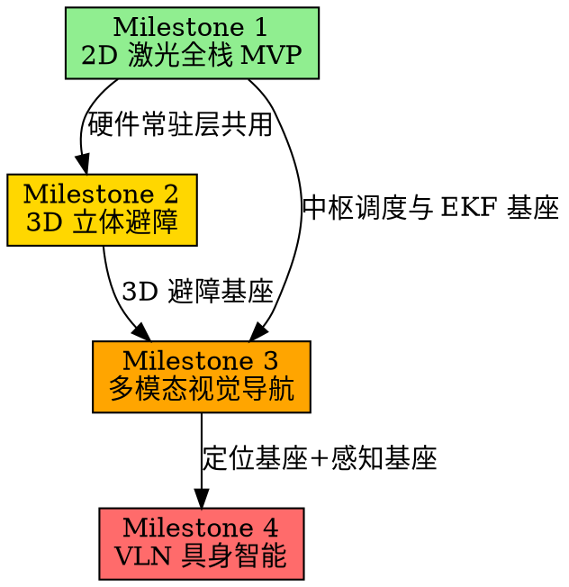

# Robot Adam 高层导航全栈系统全局规格说明书 (SPEC)

> 版本: v1.0
> 日期: 2026-06-28
> 状态: Draft

---

## 1. 系统宏观蓝图 (Top-Down Landscape)

Robot Adam 旨在构建一个解耦物理底盘、算法栈可任意插拔切换、具备类似扫地机器人"全生命周期自主调度"能力，并能通过大语言模型进行具身任务分解的高级机器人系统。

### 1.1 系统全局分层架构

系统从顶层到底层被严格划分为 5 个核心纵向层与 1 个横向资产管理中心。每一层通过标准的 ROS2 接口（Action / Service / Topic）进行通信，任何一层算法的替换，对上下层都是 100% 透明的。

```
====================================================================================
                        Level 5: 具身智能语义决策层 (adam_vln)
             [人类模糊自然语言指令] -> [Ollama/VLM 任务拆解] -> [原子 Action 序列]
====================================================================================
                                      │ (ROS2 Action / Service)
                                      ▼
====================================================================================
                  Level 4: 机器人控制中枢与状态调度层 (adam_hub_controller)
            [ROS2 Lifecycle 托管状态机] -> 动态装载/卸载建图、探索、已知图导航模块
====================================================================================
                                      │ (Lifecycle State Transitions)
                                      ▼
====================================================================================
                Level 3: 可插拔多算法导航与立体避障层 (adam_bringup / adam_navigation)
  ┌───────────────────┬───────────────────┬─────────────────────┬──────────────────┐
  │  2D 几何导航流水线 │  3D 激光导航流水线 │  传统视觉 VSLAM 流水线│ 神经网络 SLAM 流水线│
  │ Cartographer/Nav2 │  FAST-LIO2 / STVL │  ORB-SLAM3 / RTAB    │ DROID-SLAM 稠密网 │
  └───────────────────┴───────────────────┴─────────────────────┴──────────────────┘
====================================================================================
                                      │ (标准化 /cmd_vel 与全局寻路)
                                      ▼
====================================================================================
                       Level 2: 多源传感器状态估计层 (adam_localization)
            [双层 EKF 状态估计器] -> 强力锁死并融合各路 VO/LIO、车轮里程计与高频 IMU
====================================================================================
                                      │ (发布绝对稳定、不跳变的 map -> odom TF 树)
                                      ▼
====================================================================================
                 Level 1: 物理硬件与常驻驱动/仿真层 (Simulation / Hardware Base)
     [Gazebo Classic 11 / 真车硬件接口] -> (2WD/4WD/Omni 底盘) + (Mid360 / 2D雷达 / 相机)
====================================================================================

    ============================================================================
    ★ 横向支撑中心 ★：统一的数据资产与地图集中管理系统 (adam_assets)
    集中式、版本化管理全栈算法产出的所有非结构化资产（.yaml / .pgm / .pcd / .db / .json）
    ============================================================================
```

---

## 2. 问题定义与架构设计目标

### 2.1 当前现状

在底层运控包 `robot_description` 中，已成功实现了 6 种动力学与雷达变体（2WD/4WD/Omni × Mid360/Laser）的仿真基底，消除了万向轮卡死、时钟同步（`use_sim_time`）以及全向轮里程计冲突等物理层隐患。

### 2.2 高层导航痛点

* **环境资产碎片化**：不同算法（2D Laser, 3D LIO, VSLAM, Neural SLAM）生成的地图拓扑、配置文件格式极其杂乱（`.pbstream`, `.pcd`, `.db`, `.yaml`, `.json`），缺乏集中的版本控制与资产分发机制。
* **单一传感器退化**：纯激光雷达（LDS-SLAM）在面对高动态、长走廊、低纹理几何环境时极易发生几何匹配退化与重定位漂移。
* **中枢调度缺失**：建图与导航相互孤立，缺乏一个类似于"扫地机器人中枢"的生命周期管理器（Lifecycle Manager），导致无法通过外部指令平滑切换"无图探索建图"与"已知图自主导航"模式。
* **高端视觉 SLAM 缺位**：缺乏传统高精 VIO（ORB-SLAM3/VINS）与端到端神经网络 SLAM（DROID-SLAM）等多模态视觉感知方案。

### 2.3 设计目标

基于 **ROS2 Humble** 与 **Nav2 异步流水线**，构建一套"多源算法对齐、资产集中管理、开机秒级重定位、三维立体避障、AI具身决策分层"的高层导航框架：

* **多体系算法基座（激光/视觉/神经网络三栖）**：横向支持 2D/3D 激光、传统高精 VSLAM（ORB-SLAM3/VINS）以及现代稠密光流神经网络 SLAM（DROID-SLAM），提供全谱系环境感知方案。
* **统一资产与地图仓库（Assets Management）**：设立独立的数据资产包 `adam_assets`，将所有算法的配置文件、相机内参、静态栅格图、3D点云图、稠密数据库、大模型语义拓扑字典进行集中式分发管理。
* **模式高度内聚与一键启动**：建立统一的 `adam_bringup` 中枢，将 2D 几何、3D 激光、视觉/神经网络全栈流水线化。通过独立的流水线 Launch 实现"建图"、"导航"以及"边探索边建图（Mapless Frontier Exploration）"的按需加载。
* **Sim-to-Real 软硬件一体化无缝切换**：仿真环境与真车底盘常驻运行。传感器驱动与仿真接口对齐，保证上层算法 100% 不感知底层具体驱动模式与运行介质。
* **可控生命周期中枢控制器（Robot Central Controller）**：引入 ROS2 Lifecycle Node 机制，模拟扫地机器人控制中枢。支持通过上层（APP/Web/大模型决策层）下发状态切换指令，实现机器人全生命周期动态切换。

---

## 3. 全栈核心算法技术选型明细

### 3.1 2D 几何导航栈（低算力高鲁棒方案）

| 模块 | 选型 | 说明 |
|------|------|------|
| 建图（SLAM） | **Cartographer 2D** | 离线图优化，输出高质量不失真 `.pbstream` 与 `.pgm` |
| 探索（Exploration） | **explore_lite** | 基于边界前沿（Frontier）算法，计算信息增益，自动盲探 |
| 定位（Localization） | **Cartographer 纯定位模式** | 利用分支定界法（Branch-and-Bound）进行全局相关扫描匹配，支持开机一帧无感重定位 |
| 全局规划 | **Nav2 Smac Planner 2D** | Hybrid-A* / Dubins 运动学可行路径 |
| 局部控制 | **Nav2 MPPI Controller** | 模型预测路径积分，全面适配差速与全向车型 |
| 行为树恢复 | **Nav2 Behavior Tree (Spin/Backup/Wait/ClearCostmapRecovery)** | 原地旋转重定位、倒车脱困、静止等待清除代价图残影、全局路径重新规划 |

行为树恢复层是扫地机自救能力的核心。当机器人被卡住、定位漂移或代价图被残影堵塞时，Nav2 Behavior Tree 会自动按优先级依次触发恢复行为：`ClearCostmapRecovery`（清除局部代价图）→ `Spin`（原地旋转 360° 重定位）→ `Backup`（倒车退出卡死区域）→ 全局路径重规划。若所有恢复行为均失败，通过 `/adam_hub/recovery_failed` 话题上报中枢控制器，由中枢决策是否进入安全停车（Safety Stop）状态。

### 3.2 3D 激光导航栈（立体时空避障方案）

| 模块 | 选型 | 说明 |
|------|------|------|
| 前段里程计与建图 | **FAST-LIO2** | 基于流形上的迭代卡尔曼滤波（IKFoM），Mid360 与内置 IMU 紧耦合，>100Hz 超低延迟状态估计 |
| 点云降维 | **pointcloud_to_laserscan** | 将 Mid360 3D 点云切片投影为 2D 伪激光 `/scan`，解耦全局寻路维度 |
| 三维避障 | **STVL (Spatio-Temporal Voxel Layer)** | 利用 VDB 体素数据结构，引入时间轴体素自动衰减机制，完美消除动态障碍物残影 |
| 全局规划 | **Nav2 Smac Planner 3D** | Hybrid-A* 基于 3D 体素代价图进行多维规划 |
| 局部控制 | **Nav2 MPPI Controller** | 基于 3D 体素代价图进行多维预测控制 |

### 3.3 传统视觉 VSLAM 导航栈（特征点法高精方案）

| 模块 | 选型 | 说明 |
|------|------|------|
| 定位与建图 | **ORB-SLAM3 (Stereo-Inertial / RGBD-Inertial)** | 经典特征点法巅峰，利用 DBoW 视觉词袋模型具备极其强大的回环检测与冷启动拍照即锁死重定位能力 |
| 备选 VIO | **VINS-Mono** | 作为高频紧耦合滑动窗口优化的经典 VIO 备选 |
| 地图桥接与转换 | **RTAB-Map (Localization Only)** / **octomap_server** | 将视觉关键帧或稀疏点云实时投影为 Nav2 可直接识别的 2D 静态栅格或 3D 占用网格 |

### 3.4 神经网络 Neural SLAM 导航栈（端到端深度学习方案）

| 模块 | 选型 | 说明 |
|------|------|------|
| 定位与稠密跟踪 | **DROID-SLAM** | 端到端深度学习稠密光流 SLAM。通过神经网络计算稠密光流，在稠密束调整（Dense BA）层对所有像素进行迭代优化。对剧烈运动模糊、暗光、相机无遮挡抖动具有绝对鲁棒性 |
| 数据降维桥接 | **grid_projector**（自研） | 将神经网络输出的稠密三维网格降维投影至 Nav2 Costmap 形成实时局部障碍物屏障 |

### 3.5 具身智能语义决策层 (VLN)

| 模块 | 选型 | 说明 |
|------|------|------|
| 开放域目标检测 | **YOLOv11 / YOLO-World** | 零样本实时提取视野中物体标签及其 3D 空间边界框 |
| 大模型具身推理 | **Ollama + Qwen-2.5-Instruct / Qwen-2.5-VL** | 接收模糊自然语言，拆解为原子任务树，通过标准 ROS2 Action 服务驱动底盘导航 |
| 语义拓扑地图 | **semantic_map.py**（自研） | 在内存中维护 [物体标签 <-> 全局坐标] 映射的拓扑关联图 |

---

## 4. 全局统一资产管理包 (`adam_assets`) 规格定义

为了在工程上优雅地解决不同算法数据资产混乱的问题，必须将所有静态地图、配置文件、相机标定参数、大模型拓扑字典独立打包，利用标准的 ROS2 `ament_index` 机制进行检索。

### 4.1 资产包目录树定义

```
adam_assets/                            # 独立、干净的资产 ROS2 标准包
├── camera_calibration/                 # 相机标定资产
│   ├── sim_camera_intrinsics.yaml      # 仿真相机内参
│   └── real_camera_intrinsics.yaml     # 真实相机内参
├── maps_2d/                            # 2D 几何地图资产
│   ├── apartment_map.yaml              # Nav2 2D 栅格描述文件
│   ├── apartment_map.pgm               # Nav2 2D 栅格图片文件
│   └── apartment_map.pbstream          # Cartographer 专用离线图优化子图序列化文件
├── maps_3d/                            # 3D 激光地图资产
│   └── laboratory_cloud.pcd            # FAST-LIO2 生成的全局高精无损点云地图
├── maps_vision/                        # 视觉地图资产
│   ├── orb_slam3_vocabulary.bin        # ORB-SLAM3 离线特征点词袋库
│   └── rtabmap_apartment.db            # RTAB-Map 生成的 SQLITE3 稠密三维数据库
├── maps_semantic/                      # AI 语义拓扑资产
│   └── bigH_world_topology.json        # YOLO投影解算后生成的 [物体标签 <-> 全局三维坐标] 关系拓扑字典
├── CMakeLists.txt
└── package.xml
```

### 4.2 资产读取代码规范

### 4.2 资产归档机制（地图保存闭环）

底层算法节点运行在各自沙盒中，无权限直接写入 `adam_assets` 源码包的 `share/` 路径。必须建立标准的中转归档流程：

```
触发 /adam_hub/save_current_map 服务
        │
        ▼
底层算法将地图写入 /tmp/adam_maps/{timestamp}/ （临时中转区）
        │
        ▼
adam_hub_controller 调用资产归档脚本
        │
        ▼
脚本将文件移动至 src/3.navigation_ai/adam_assets/{maps_2d,maps_3d,...}/
        │
        ▼
触发 colcon build --packages-select adam_assets 刷新 install/ 中的 share 路径
        │
        ▼
中枢控制器确认 install/share/adam_assets/ 下文件已就绪
```

```python
# adam_hub_controller/scripts/archive_map.py
import shutil, subprocess, os
from ament_index_python.packages import get_package_share_directory

def archive_map(temp_path: str, target_subdir: str, filename: str):
    ws_root = os.path.expanduser("~/robot_adam_ws")
    target = os.path.join(ws_root, "src/3.navigation_ai/adam_assets", target_subdir, filename)
    shutil.copy2(temp_path, target)
    subprocess.run(["colcon", "build", "--packages-select", "adam_assets"],
                   cwd=ws_root, capture_output=True)
    # 验证归档成功
    final_path = get_package_share_directory("adam_assets") + "/" + target_subdir + "/" + filename
    assert os.path.exists(final_path), f"Map archive failed: {final_path} not found"
```

### 4.3 资产读取代码规范

所有 Python 节点通过 `ament_index_python` 统一调阅资产，禁止使用硬编码路径：

```python
import os
from ament_index_python.packages import get_package_share_directory

def get_asset_path(sub_folder, file_name):
    """通过 ROS2 package 路径机制动态、绝对安全地获取资产路径"""
    package_path = get_package_share_directory('adam_assets')
    return os.path.join(package_path, sub_folder, file_name)

# 示例：中枢控制器需要加载 2D 地图
map_config_path = get_asset_path('maps_2d', 'apartment_map.yaml')
```

---

## 5. 中枢生命周期管理器 (`adam_hub_controller`) 逻辑定义

中枢控制器作为扫地机器人控制中枢，其核心本质是一个 ROS2 `LifecycleNode`（托管节点）。它不参与底层导航计算，但死死控住底层所有计算节点的生命周期。

### 5.1 核心状态机转换逻辑

```
  [Unconfigured] (系统冷启动，仿真/真车雷达与相机常驻)
         │
         ▼ Trigger: configure()
    [Inactive] (中枢就绪，静默等待指令)
         │
         ├──► Trigger: activate_exploration()
         │        ──► 激活 [2D/3D/视觉/神经网络] 对应建图 + 自动探索
         │               │
         │               ▼ Trigger: map_complete_service
         │◄────────────────────────────── 自动保存资产至 adam_assets 并挂起
         │
         └──► Trigger: activate_navigation()
                  ──► 加载 adam_assets 静态资源 + 对应纯定位 + Nav2 Stack
```

### 5.2 核心服务接口定义 (Service/Action)

| 接口 | 类型 | 说明 |
|------|------|------|
| `/adam_hub/switch_mode` | `std_srvs/srv/SetBool` | `True` = 启动无图探索建图，`False` = 进入已知图自主导航 |
| `/adam_hub/save_current_map` | `std_srvs/srv/Trigger` | 触发底层建图节点进行资产序列化，写入 `adam_assets` |

### 5.3 状态迁移与底层节点挂载矩阵

**⚡ TF 树广播权硬约束**：任何时候，有且仅有一个节点拥有 `/tf` 中 `map -> odom` 的广播权。所有 SLAM/VSLAM 节点在配置中必须将 `publish_tf` 设为 `false`，将其位姿作为 `nav_msgs/msg/Odometry` 话题输出给 `adam_localization` 层的 `dual_ekf_node`，由 EKF 统一发布唯一的、绝对平滑的 `map -> odom` TF。违反此约束将导致底盘运控瞬间死锁。

| 模式指令 | 中枢 Lifecycle 状态 | 动态激活的子节点 | 动态挂起的子节点 |
|----------|-------------------|-----------------|-----------------|
| **1. 无图探索建图** | `Active (Exploring)` | `cartographer_node`, `explore_lite_node`, `nav2_planner`, `nav2_controller` | `cartographer_localization_mode` |
| **2. 地图落盘触发** | `Transitioning` | 调用服务将 `.pbstream` 与 `.yaml` 写入 `adam_assets` | 无 |
| **3. 已知图纯定位导航** | `Active (Navigating)` | `cartographer_localization_mode`, `nav2_planner`, `nav2_controller` | `explore_lite_node`, `cartographer_mapping_mode` |

### 5.4 传感器健康度监控与算法退化降级

高精视觉/神经网络 SLAM（ORB-SLAM3、DROID-SLAM）在黑暗、低纹理或相机被遮挡场景下会发生跟踪丢失。中枢控制器必须内置传感器健康度监控机制：

**协方差阈值监控**：
- `adam_localization` 的 `dual_ekf_node` 持续监听各路里程计输入的位姿协方差矩阵。
- 当视觉里程计协方差对角元素连续 N 帧（N 可配置，默认 10 帧 @ 30Hz）超过阈值 `cov_threshold`，`dual_ekf_node` 发布 `sensor_health/vision_lost` 事件。

**自动降级流程**：
```
[sensor_health/vision_lost 事件触发]
        │
        ▼
adam_hub_controller 收到事件
        │
        ├──► 将全局定位源从 VO/LIO 无缝切换至纯轮速计 + IMU EKF
        │
        ├──► 触发 Nav2 Behavior Tree 的 ClearCostmapRecovery（清除可能因错误位姿产生的代价图残影）
        │
        ├──► 通过 /adam_hub/sensor_status 话题向上层（APP/Web/VLN）上报 "视觉丢失，已降级至激光/轮速计模式"
        │
        └──► 持续监控视觉协方差，一旦恢复至阈值内，自动切回融合模式
```

此机制确保任何一路传感器 Lost 时，整车不会瞬间失控撞墙，而是优雅降级至更保守的导航模式。

---

## 6. 工作空间与包组织结构 (Workspace Layout)

```
robot_adam/                          # 统一的 ROS2 工作空间根目录
├── build_sim.sh                         # 一键编译并配置环境的通用脚本
└── src/
    │
    ├── 1.simulation/                   # ===== 仿真物理与描述层 =====
    │   └── robot_description/          # [已收官] 6种运控变体底盘、Xacro宏、Gazebo插件及World
    │
    ├── 2.localization_mapping/         # ===== 状态估计、多源建图与多模态感知层 =====
    │   ├── adam_slam/                  # 激光建图、无图探索与快速重定位包
    │   │   ├── config/                 # Cartographer 2D/3D 参数、explore_lite 边界探索参数
    │   │   ├── launch/
    │   │   │   ├── cartographer_mapping.launch.py      # 2D 激光建图
    │   │   │   ├── cartographer_localization.launch.py # 2D 一帧雷达扫描全局重定位
    │   │   │   └── fast_lio_odometry.launch.py         # 3D Mid360 雷达惯导里程计
    │   │   └── package.xml
    │   │
    │   ├── adam_vision/                # 传统视觉 SLAM 与目标识别
    │   │   ├── config/                 # ORB-SLAM3 标定参数(仿真/真车相机分流)、RTAB-Map配置
    │   │   ├── launch/
    │   │   │   ├── orbslam3_vio.launch.py              # ORB-SLAM3 视觉惯导高精里程计
    │   │   │   └── yolo_detector.launch.py             # YOLOv11/World 实时开放域识别节点
    │   │   └── package.xml
    │   │
    │   ├── adam_neural_slam/           # [新加] 神经网络与端到端深度学习 SLAM 包
    │   │   ├── adam_neural_slam/
    │   │   │   ├── droid_slam_node.py  # DROID-SLAM 的 ROS2 稠密光流优化推理外壳
    │   │   │   └── grid_projector.py   # 将神经网络稠密三维网格投影降维为 Nav2 栅格
    │   │   ├── config/                 # 网络权重路径配置、特征提取阈值参数
    │   │   ├── launch/
    │   │   │   └── neural_slam_dense.launch.py         # DROID-SLAM 高鲁棒数据流水线
    │   │   └── package.xml
    │   │
    │   └── adam_localization/          # 核心多源传感器融合包
    │       ├── config/
    │       │   └── ekf_nav_filter.yaml # 统一解耦融合 IMU + 轮速计 + VO + LIO
    │       ├── launch/
    │       │   └── state_estimation.launch.py  # 向Nav2输出平滑无跳变的 map->odom
    │       └── package.xml
    │
    └── 3.navigation_ai/                # ===== 核心控制、中枢资产、时空规划与大模型AI决策层 =====
        ├── adam_assets/                # [新加] 全局静态地图与算法资产配置中心仓库
        │   ├── camera_calibration/     # 相机内参 YAML（仿真/真车）
        │   ├── maps_2d/                # Cartographer/SLAM Toolbox 的 .pgm + .yaml + .pbstream
        │   ├── maps_3d/                # FAST-LIO2 的全局无损点云 .pcd
        │   ├── maps_vision/            # ORB-SLAM3 词袋文件 + RTAB-Map 的 .db
        │   ├── maps_semantic/          # VLN 依赖的拓扑空间关系 .json
        │   ├── CMakeLists.txt
        │   └── package.xml             # 标准 ROS2 包，支持 $(find adam_assets) 调阅
        │
        ├── adam_bringup/               # 全局启动与中枢调度层（核心总入口）
        │   ├── config/                 # 中枢生命周期参数
        │   ├── launch/
        │   │   ├── adam_2d_nav_full.launch.py          # 2D 全栈流水线
        │   │   ├── adam_3d_nav_full.launch.py          # 3D 全栈流水线
        │   │   ├── adam_vision_nav_full.launch.py      # [新加] 传统视觉全栈流水线
        │   │   ├── adam_neural_nav_full.launch.py      # [新加] 神经网络视觉流水线
        │   │   └── base_hardware_constant.launch.py    # 底盘与传感器常驻启动
        │   └── package.xml
        │
        ├── adam_hub_controller/        # 机器人中枢控制器
        │   ├── adam_hub_controller/
        │   │   ├── __init__.py
        │   │   ├── hub_manager_node.py # Lifecycle 状态转换与模式切换服务
        │   │   └── state_machine.py    # 状态机逻辑
        │   ├── srv/                    # 自定义模式切换服务定义
        │   └── package.xml
        │
        ├── adam_navigation/            # 传统几何导航核心包（Nav2 二次封装）
        │   ├── config/
        │   │   ├── nav2_diff_drive.yaml# 差速车 Nav2 + Smac + MPPI 参数
        │   │   └── nav2_omni_drive.yaml# 全向车 Holonomic + STVL 参数
        │   ├── launch/
        │   │   └── navigation.launch.py
        │   └── package.xml
        │
        └── adam_vln/                   # 视觉语言导航与具身智能决策
            ├── adam_vln/
            │   ├── __init__.py
            │   ├── vln_server_node.py  # 语义导航主节点
            │   ├── llm_reasoner.py     # Ollama 大模型通信适配器
            │   └── semantic_map.py     # 拓扑语义地图数据库
            └── package.xml
```

---

## 7. Bottom-Up 工程实现阶段拆解 (Implementation Roadmap)

秉承"最简闭环、小步快跑、层层递进"的原则，将开发计划拆解为 **4 个里程碑（Milestones）**。

### 📅 Milestone 1: 基础设施打通与 2D 激光全栈 MVP (P0+P1)

**目标**：在 Gazebo 仿真环境中，彻底跑通"常驻底盘 -> 自动探索建图 -> 地图序列化落盘至 `adam_assets` -> 二次开机一帧重定位 -> 纯导航"的扫地机核心闭环。

**Bottom-Up 步骤**：

| 步骤 | 任务 | 产出 |
|------|------|------|
| 1.1 | 创建 `adam_assets` 包架构，编写 `CMakeLists.txt` 与 `package.xml` | 可编译分发的空资产包 |
| 1.2 | 在 `adam_localization` 中编写 `ekf_nav_filter.yaml`，融合车轮里程计 + IMU | 在 Rviz 中观察到 `odom -> base_link` 绝对平滑无抖动 |
| 1.3 | 编写 `adam_hub_controller` 骨架：Lifecycle 节点 + 状态机 + 模式切换服务 | 可运行的中枢控制器 |
| 1.4 | 配置 Cartographer 2D 参数 + `explore_lite` 参数，通过中枢一键启动 | 小车在 `bigH.world` 中自主探索并吐出栅格图 |
| 1.5 | 实现地图保存服务，将 `.pbstream` 存入 `adam_assets`；二次开机验证分支定界一帧重定位 | map -> odom 瞬间对齐 |

**依赖安装**：
```bash
sudo apt install ros-humble-cartographer ros-humble-cartographer-ros
sudo apt install ros-humble-navigation2 ros-humble-nav2-bringup
# explore_lite 需要源码编译
```

### 📅 Milestone 2: 空间升维与 3D 立体避障 (P2)

**目标**：物理常驻雷达由 2D 切换为 3D 固态雷达 Mid360，解决悬空障碍物和动态人流过后的"幽灵残影"问题。

**Bottom-Up 步骤**：

| 步骤 | 任务 | 产出 |
|------|------|------|
| 2.1 | 源码编译并配置 FAST-LIO2，对接 Mid360 仿真点云 + IMU | 输出 >100Hz 高频 `/odom_3d` |
| 2.2 | 在 Nav2 配置中将 2D Costmap 插件替换为 STVL | 3D 体素代价图 |
| 2.3 | 调整 STVL 的 `voxel_decay` 时间参数，验证体素自动消散 | 动态障碍物残影消失 |
| 2.4 | 启动 `pointcloud_to_laserscan` 为全局规划器提供低维 `/scan_3d_projected` | 2D 伪激光话题 |

**依赖安装**：
```bash
sudo apt install ros-humble-pointcloud-to-laserscan
# FAST-LIO2 与 STVL 需源码编译
```

### 📅 Milestone 3: 特征固化与多模态视觉导航栈 (P3)

**目标**：引入传统 VSLAM 的强回环能力与神经网络 SLAM 的极端鲁棒性，彻底解决激光雷达在低几何特征场景下的退化问题。

**Bottom-Up 步骤**：

| 步骤 | 任务 | 产出 |
|------|------|------|
| 3.1 | 将相机内参文件标准化写入 `adam_assets/camera_calibration/` | 标定资产入库 |
| 3.2 | 编译 ORB-SLAM3 ROS2 封装，加载词袋文件，验证仿真环境中视觉重定位 | 视觉里程计闭环 |
| 3.3 | 配置 GPU 加载 DROID-SLAM 推理内核，编写 `grid_projector` 节点 | 神经网络稠密跟踪闭环 |
| 3.4 | 在 `adam_localization` 中开启第二个 EKF 实例，融合激光/视觉/神经里程计 + 轮速计 | 多源绝对不丢失里程计基座 |

### 📅 Milestone 4: 具身智能脑眼协同与大模型 VLN (P4)

**目标**：机器人具备"听懂人话、看懂世界、自主拆解、精准导航"的具身智能完全体形态。

**Bottom-Up 步骤**：

| 步骤 | 任务 | 产出 |
|------|------|------|
| 4.1 | 启动 YOLOv11/YOLO-World 节点，消费单目/双目图像流 | 实时开放域目标检测 |
| 4.2 | 在 `semantic_map.py` 中编写 3D 射线投影算法，将 2D 边界框与深度数据结合解算物体 3D 坐标 | 动态写入 `adam_assets/maps_semantic/` |
| 4.3 | 拉起 Ollama (Qwen-2.5)，编写系统提示词强制输出标准 JSON 任务树 | 自然语言 -> 原子任务分解 |
| 4.4 | 打通全链条：大模型解析 -> 中枢控制器 -> 底层导航栈 | 机器人自主导航至目标物体 |

---

## 8. 依赖及相关开源仓库

### 8.1 2D/3D 激光与自主探索

| 仓库 | 链接 | 用途 |
|------|------|------|
| Cartographer ROS2 | https://github.com/ros2/cartographer_ros | 2D 高精建图与分支定界全局重定位 |
| m-explore (explore_lite) | https://github.com/hrnr/m-explore/tree/ros2 | 基于边界前沿的无图自主探索 |
| Navigation2 (Nav2) | https://github.com/ros-navigation/navigation2 | Smac 规划器 + MPPI 控制器 |
| FAST-LIO | https://github.com/hku-mars/FAST_LIO | 3D Mid360 前端雷达惯导里程计 |
| | _⚠ 注意：官方仓库已停更，仅支持 ROS1。必须使用社区 ROS2 移植分支（如 `EmarUn/fast_lio_rviz` 或 `lifegpc/FAST_LIO`），并在 ROS2 Humble 上验证编译通过后再集成_ | |
| STVL | https://github.com/SteveMacenski/spatio_temporal_voxel_layer | 3D 动态体素时空衰减 |
| Pointcloud to Laserscan | https://github.com/ros-perception/pointcloud_to_laserscan | 3D 点云降维投影 |

### 8.2 传统与神经网络视觉 SLAM

| 仓库 | 链接 | 用途 |
|------|------|------|
| ORB-SLAM3 ROS2 | https://github.com/thien94/ORB_SLAM3_ROS2 | 双目/单目惯导高精 VSLAM |
| VINS-Mono ROS2 | https://github.com/TechColonial/VINS-Mono-ROS2 | 滑动窗口优化 VIO 备选 |
| DROID-SLAM | https://github.com/princeton-vl/DROID-SLAM | 端到端稠密光流神经网络 SLAM |
| | _⚠ 架构约束：DROID-SLAM 官方基于 PyTorch，Python GIL 锁会导致 ROS2 回调阻塞。必须采用独立 C++ 推理进程（TensorRT 加速版）通过共享内存（Shared Memory）与 ROS2 节点通信。禁止在 ROS2 回调函数中直接执行神经网络推理_ | |
| RTAB-Map ROS2 | https://github.com/introlab/rtabmap_ros | 视觉稠密回环检测与地图桥接 |

### 8.3 AI 决策核心

| 仓库 | 链接 | 用途 |
|------|------|------|
| Ultralytics YOLO | https://github.com/ultralytics/ultralytics | YOLOv11/World 实时开放域目标检测 |
| Ollama | https://github.com/ollama/ollama | 本地大模型推理框架 |

---

## 9. 里程碑优先级与依赖关系图



* **Milestone 1 (P0+P1)**：2D 激光全栈 MVP，最短路径跑通扫地机闭环。**起点。**
* **Milestone 2 (P2)**：在 M1 的中枢与 EKF 基座上替换 3D 传感器。与 M3 可并行准备。
* **Milestone 3 (P3)**：在 M1 的中枢调度与 EKF 基座上接入视觉 SLAM。**依赖 M1。**
* **Milestone 4 (P4)**：在 M1+M2+M3 的完整定位基座上叠加 AI 决策层。**依赖所有前序里程碑。**
